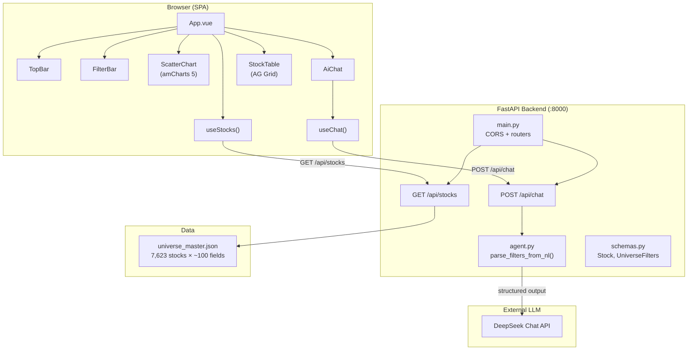
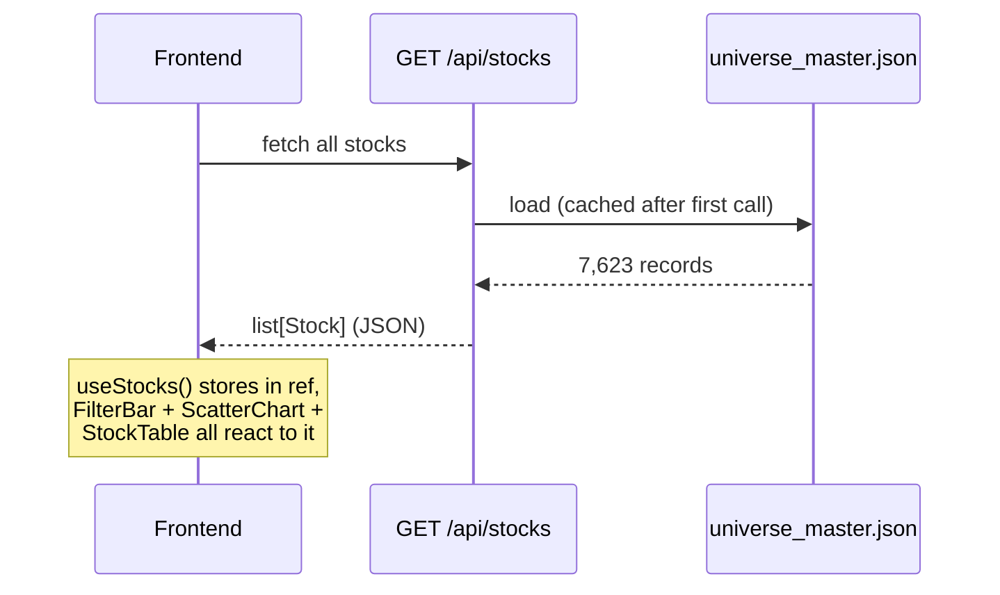
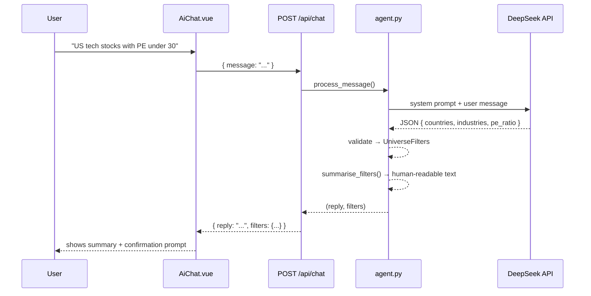
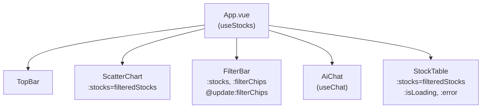
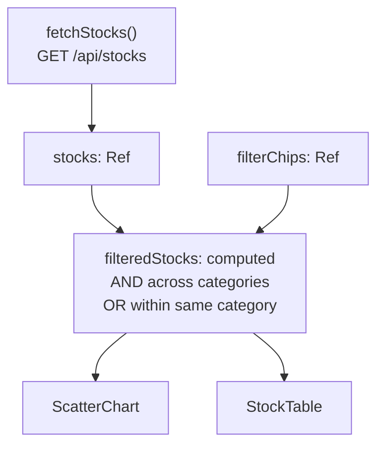
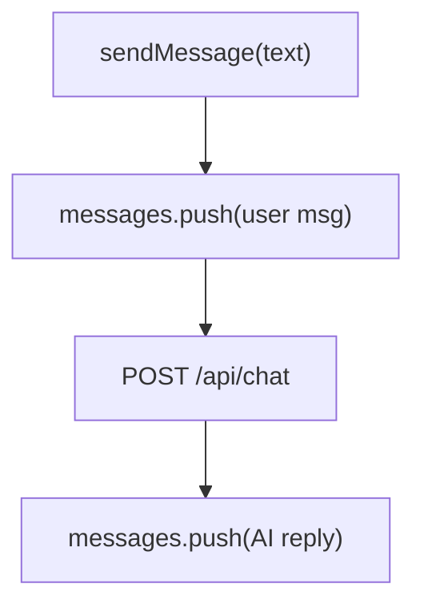
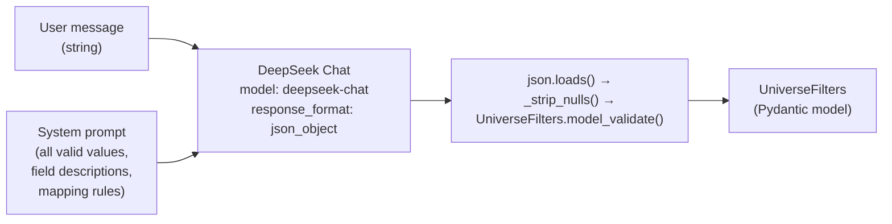
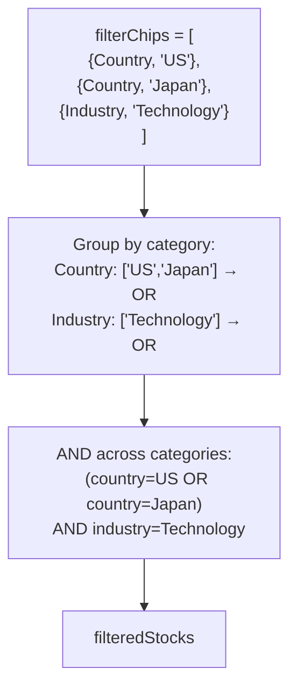
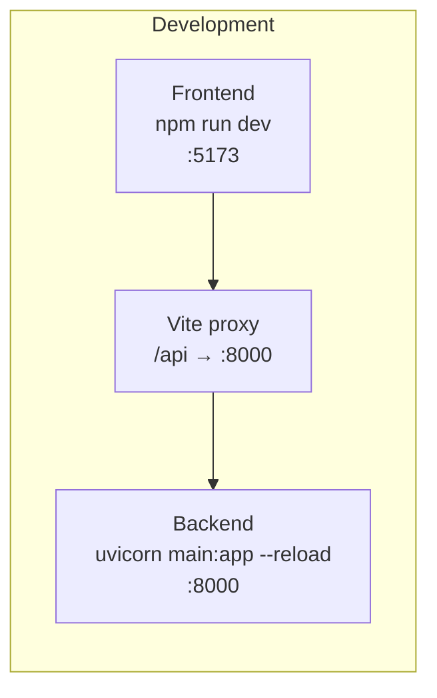

# Stock Universe — Architecture

## System Overview



---

## Request Flow

### Stock Data



### NLP Chat-to-Filters



---

## Directory Map

```text
stock-universe/
│
├── data/
│   └── universe_master.json         # Source of truth: 7,623 stocks
│                                     # Fields: Code, Name, Ticker, Country,
│                                     # Industry, Exchange, Price, Market_Cap,
│                                     # Pe_Ratio, Returns, Volatility, Sharpe, etc.
│
├── backend/
│   ├── main.py                      # FastAPI app, CORS, router mounts
│   ├── pyproject.toml               # Python deps + ruff/pytest config
│   ├── .env.example                 # DEEPSEEK_API_KEY template
│   │
│   ├── routers/
│   │   ├── stocks.py                # GET /api/stocks → cached JSON load
│   │   └── chat.py                  # POST /api/chat → agent.process_message()
│   │
│   ├── services/
│   │   └── agent.py                 # Core NLP logic:
│   │                                #   parse_filters_from_nl() → UniverseFilters
│   │                                #   summarise_filters() → human-readable text
│   │                                #   process_message() → (reply, filters)
│   │                                #   SYSTEM_PROMPT with all valid values
│   │                                #   _build_json_schema() for reference
│   │
│   ├── models/
│   │   └── schemas.py               # Pydantic models:
│   │                                #   Stock (with aliases for universe JSON)
│   │                                #   NumericRange (min/max)
│   │                                #   UniverseFilters (all filter fields)
│   │                                #   ChatRequest / ChatResponse
│   │
│   ├── scripts/
│   │   └── test_parse_filters.py    # CLI tool to test NLP pipeline live
│   │
│   ├── docs/
│   │   └── sample_chat_responses.json  # 7 example request/response pairs
│   │
│   ├── data/
│   │   └── stocks.json              # Legacy 10-stock sample (unused)
│   │
│   └── tests/
│       ├── test_stocks.py           # GET /api/stocks endpoint tests
│       └── test_agent.py            # 16 tests: models, summariser,
│                                    #   mocked LLM parsing, helpers
│
└── frontend/
    ├── index.html                   # HTML shell
    ├── package.json                 # Node deps (Vue, amCharts, AG Grid, Bootstrap)
    ├── vite.config.ts               # Dev server + /api proxy → :8000
    ├── tsconfig.json                # TypeScript config
    │
    └── src/
        ├── main.ts                  # App bootstrap, plugin registration
        ├── App.vue                  # Root: owns useStocks(), wires children
        │
        ├── components/
        │   ├── TopBar.vue           # Header bar with logo
        │   ├── FilterBar.vue        # Autocomplete input with tag chips
        │   ├── ScatterChart.vue     # amCharts 5 scatter plot
        │   ├── StockTable.vue       # AG Grid with sorting + pagination
        │   └── AiChat.vue           # Chat sidebar panel
        │
        ├── composables/
        │   ├── useStocks.ts         # Stock fetching + chip-based filtering
        │   └── useChat.ts           # Chat messages + POST /api/chat
        │
        ├── types/
        │   └── stock.ts             # Stock, StockFilters, FilterChip, ChatMessage
        │
        └── styles/
            ├── main.scss            # Global entry point
            ├── _variables.scss      # Theme colours + spacing
            ├── _ag-grid-theme.scss  # AG Grid dark theme overrides
            ├── _bootstrap-overrides.scss
            └── _utilities.scss      # Helper classes
```

---

## Frontend Components

### Component Tree



### Component Responsibilities

| Component        | Role                                                                             |
| ---------------- | -------------------------------------------------------------------------------- |
| **App.vue**      | Root orchestrator. Calls `useStocks()`, fetches on mount, passes data to children. |
| **TopBar**       | App header with logo and title.                                                  |
| **FilterBar**    | Autocomplete search with inline tag chips. Matches across all stock fields. Emits chip updates. |
| **ScatterChart** | amCharts 5 scatter plot (Market Cap vs P/E), coloured by industry. Receives filtered stocks. |
| **StockTable**   | AG Grid Enterprise table with server-style sorting and pagination. Receives filtered stocks. |
| **AiChat**       | Chat sidebar. Sends user messages to `/api/chat`, displays AI replies with filter summaries. |

---

## Composables (State Management)

### `useStocks()`

Called once in `App.vue`. Owns all stock data and filtering state.



### `useChat()`

Called inside `AiChat.vue`. Manages chat message history independently.



---

## Backend: NLP-to-Filters Pipeline

### How `parse_filters_from_nl()` Works



### `UniverseFilters` Schema

```text
UniverseFilters
├── Categorical (list[str] | None)
│   ├── countries         # "United States", "Japan", ...
│   ├── industries        # "Technology", "Healthcare", ...
│   ├── sub_industries    # "Software & IT Services", ...
│   ├── currencies        # "USD", "EUR", "JPY", ...
│   └── exchanges         # "NYSE", "Nasdaq", "Tokyo SE", ...
│
├── Text search (str | None)
│   └── search            # substring match on ticker/name
│
├── Fundamentals (NumericRange | None)
│   ├── price
│   ├── market_cap
│   ├── pe_ratio
│   ├── pb_ratio
│   ├── dividend_yield
│   ├── earnings_per_share
│   └── return_on_equity
│
├── Returns (NumericRange | None)
│   ├── return_1m / 3m / 6m / 1y / 3y / 5y / ytd
│
└── Risk (NumericRange | None)
    ├── volatility_1y
    ├── sharpe_1y
    ├── sortino_1y
    └── max_drawdown_1y

NumericRange = { min: float | None, max: float | None }
```

### System Prompt Strategy

The system prompt in `agent.py` includes:
- All valid categorical values (countries, industries, exchanges, currencies) with exact spelling
- A table mapping each numeric filter key to its meaning
- Mapping rules for common phrases (e.g., "cheap stocks" → `price.max: 20`, "large cap" → `market_cap.min: 10000`)
- Instructions to only set fields the user mentioned and to return `{}` when no filter is detected

---

## Data: `universe_master.json`

7,623 stock records, each with approximately 100 fields:

| Category      | Example Fields                                                          |
| ------------- | ----------------------------------------------------------------------- |
| Identity      | Code, Name, Ticker, RIC, ISIN, SEDOL, FIGI                            |
| Classification| Country, Industry, Sub-Industry, Exchange, Currency                     |
| Fundamentals  | Price, Market\_Cap, Pe\_Ratio, Pb\_Ratio, Dividend\_Yield, EPS, ROE     |
| Returns       | Return\_{1M, 3M, 6M, 1Y, 3Y, 5Y, 10Y, MTD, QTD, YTD}                |
| Volatility    | Volatility\_{1M, 3M, 6M, 1Y, 3Y, 5Y, 10Y, MTD, QTD, YTD}            |
| Sharpe        | Sharpe\_{1M, 3M, ..., YTD}                                            |
| Sortino       | Sortino\_{1M, 3M, ..., YTD}                                           |
| Skewness      | Skewness\_{1M, 3M, ..., YTD}                                          |
| Kurtosis      | Kurtosis\_{1M, 3M, ..., YTD}                                          |
| Max Drawdown  | Max\_Drawdown\_{1M, 3M, ..., YTD}                                     |
| VaR           | VaR\_{1M, 3M, ..., YTD}                                               |

The `Stock` Pydantic model uses field aliases (e.g., `Field(alias="Market_Cap")`) to map JSON keys to snake\_case Python attributes. Fields with `None` in the source data are coerced to empty strings for text fields via the `StrOrEmpty` validator.

---

## Filter Chip System (Frontend)

### FilterChip Type

```typescript
interface FilterChip {
  category: string;   // "Country", "Industry", "Ticker", "Price", etc.
  value: string;      // "United States", "Technology", "AAPL", etc.
}
```

### Filtering Logic



- **Within a category**: OR logic (match any)
- **Across categories**: AND logic (must satisfy all)

---

## Testing

### Test Files

| File                    | Tests | What it covers                                              |
| ----------------------- | ----- | ----------------------------------------------------------- |
| `tests/test_stocks.py`  | 4     | GET /api/stocks returns data with expected schema fields    |
| `tests/test_agent.py`   | 16    | UniverseFilters model, summarise\_filters(), parse with mocked LLM, helpers |

### Running Tests

```bash
cd backend
source .venv/bin/activate
pytest -v                     # all tests
pytest tests/test_agent.py -v # just NLP agent tests
pytest tests/test_stocks.py -v # just stock endpoint tests
```

All agent tests mock the DeepSeek API call, so no API key or network access is needed.

---

## Development Workflow



1. Start the backend: `cd backend && uvicorn main:app --reload`
2. Start the frontend: `cd frontend && npm run dev`
3. Open **http://localhost:5173** in your browser
4. The Vite dev server proxies all `/api/*` requests to the backend at `:8000`
