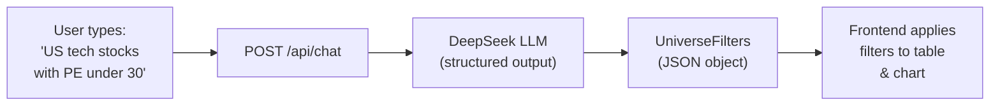

# Stock Universe

A single-page stock universe explorer powered by an AI chat assistant that converts natural language into structured filters. Users describe what they want in plain English, the system extracts filters via an LLM, and the matching stocks are displayed in an interactive scatter chart and sortable table.

## Tech Stack

| Layer    | Technology                                  |
| -------- | ------------------------------------------- |
| Frontend | Vue 3 (Composition API) + Vite + TypeScript |
| Charts   | amCharts 5                                  |
| Table    | AG Grid Enterprise                          |
| Backend  | Python 3.11+ / FastAPI / Pydantic v2        |
| LLM      | DeepSeek Chat (OpenAI-compatible API)       |
| Data     | `data/universe_master.json` (7,623 stocks)  |

## Quick Start

### Prerequisites

- Python 3.11+
- Node.js 18+
- [uv](https://github.com/astral-sh/uv) (recommended) or pip
- A DeepSeek API key ([platform.deepseek.com](https://platform.deepseek.com))

### 1. Clone and set up the backend

```bash
cd backend

# Create a virtual environment and install dependencies
uv venv && uv pip install -e ".[dev]"

# Or with plain pip:
# python -m venv .venv && source .venv/bin/activate && pip install -e ".[dev]"

# Configure your API key
cp .env.example .env
# Edit .env and set DEEPSEEK_API_KEY=sk-your-key-here

# Start the API server
source .venv/bin/activate
uvicorn main:app --reload
```

The API runs at **http://localhost:8000**.

### 2. Set up the frontend

```bash
cd frontend
npm install
npm run dev
```

The app opens at **http://localhost:5173**. API requests are proxied to the backend via Vite.

### 3. Run tests

```bash
cd backend
source .venv/bin/activate
pytest -v
```

This runs both the stock endpoint tests and the NLP agent tests (with mocked LLM calls — no API key needed for tests).

### 4. Test the NLP filter parser interactively

```bash
cd backend
source .venv/bin/activate
python scripts/test_parse_filters.py
```

Runs sample queries against the live DeepSeek API and prints the extracted filters. You can also pass a query directly:

```bash
python scripts/test_parse_filters.py "show me US tech stocks with PE under 30"
```

## API Endpoints

| Method | Path          | Description                                      |
| ------ | ------------- | ------------------------------------------------ |
| GET    | `/api/stocks` | Returns all 7,623 stocks from the universe       |
| POST   | `/api/chat`   | Accepts natural language, returns filters + reply |
| GET    | `/api/health` | Health check                                     |

### `POST /api/chat` — Example

**Request:**

```json
{ "message": "show me US tech stocks with PE under 30" }
```

**Response:**

```json
{
  "reply": "I understood the following filters from your request:\n\nCountry = United States, Industry = Technology, P/E Ratio <= 30\n\nWould you like me to apply these filters?",
  "filters": {
    "countries": ["United States"],
    "industries": ["Technology"],
    "pe_ratio": { "min": null, "max": 30.0 }
  }
}
```

The `filters` object is `null` when no actionable filters are detected.

## Project Structure

```text
stock-universe/
├── data/
│   └── universe_master.json        # 7,623 stocks with ~100 fields each
│
├── backend/                        # Python FastAPI
│   ├── main.py                     # App entry point, CORS, router mounts
│   ├── pyproject.toml              # Dependencies and tool config
│   ├── .env.example                # Template for API key
│   ├── routers/
│   │   ├── stocks.py               # GET /api/stocks — serves universe data
│   │   └── chat.py                 # POST /api/chat — NLP filter endpoint
│   ├── services/
│   │   └── agent.py                # LLM integration: parse_filters_from_nl()
│   ├── models/
│   │   └── schemas.py              # Pydantic models (Stock, UniverseFilters, etc.)
│   ├── scripts/
│   │   └── test_parse_filters.py   # Interactive script to test the NLP pipeline
│   ├── docs/
│   │   └── sample_chat_responses.json  # Sample request/response pairs
│   └── tests/
│       ├── test_stocks.py          # Stock endpoint tests
│       └── test_agent.py           # NLP agent tests (mocked LLM)
│
└── frontend/                       # Vue 3 + Vite + TypeScript
    ├── index.html
    ├── package.json
    ├── vite.config.ts              # Dev server + API proxy config
    ├── tsconfig.json
    └── src/
        ├── App.vue                 # Root component, owns stock state
        ├── main.ts                 # App bootstrap
        ├── components/
        │   ├── TopBar.vue          # App header with logo
        │   ├── FilterBar.vue       # Autocomplete tag-based filter bar
        │   ├── ScatterChart.vue    # amCharts scatter plot
        │   ├── StockTable.vue      # AG Grid sortable/paginated table
        │   └── AiChat.vue          # AI chat sidebar panel
        ├── composables/
        │   ├── useStocks.ts        # Stock data fetching + client-side filtering
        │   └── useChat.ts          # Chat message state + API calls
        ├── types/
        │   └── stock.ts            # TypeScript interfaces
        └── styles/
            ├── main.scss           # Global styles entry
            ├── _variables.scss     # Theme variables
            └── ...
```

## How It Works



1. The user types a natural-language query in the AI chat panel.
2. The frontend sends it to `POST /api/chat`.
3. The backend calls DeepSeek with a system prompt describing all available filter dimensions and valid values.
4. DeepSeek returns a JSON object matching the `UniverseFilters` schema.
5. The backend replies with a human-readable summary and the structured filters.
6. The frontend can apply those filters to the stock table and scatter chart.

## Available Filters

The NLP pipeline can extract the following filter types from natural language:

| Category      | Filter Fields                                                       |
| ------------- | ------------------------------------------------------------------- |
| Categorical   | `countries`, `industries`, `sub_industries`, `currencies`, `exchanges` |
| Text search   | `search` (matches ticker or company name)                           |
| Fundamentals  | `price`, `market_cap`, `pe_ratio`, `pb_ratio`, `dividend_yield`, `earnings_per_share`, `return_on_equity` |
| Returns       | `return_1m`, `return_3m`, `return_6m`, `return_1y`, `return_3y`, `return_5y`, `return_ytd` |
| Risk          | `volatility_1y`, `sharpe_1y`, `sortino_1y`, `max_drawdown_1y`      |

Each numeric filter supports `min` and/or `max` bounds. Categorical filters accept a list of values.

## License

See [LICENSE](LICENSE).
